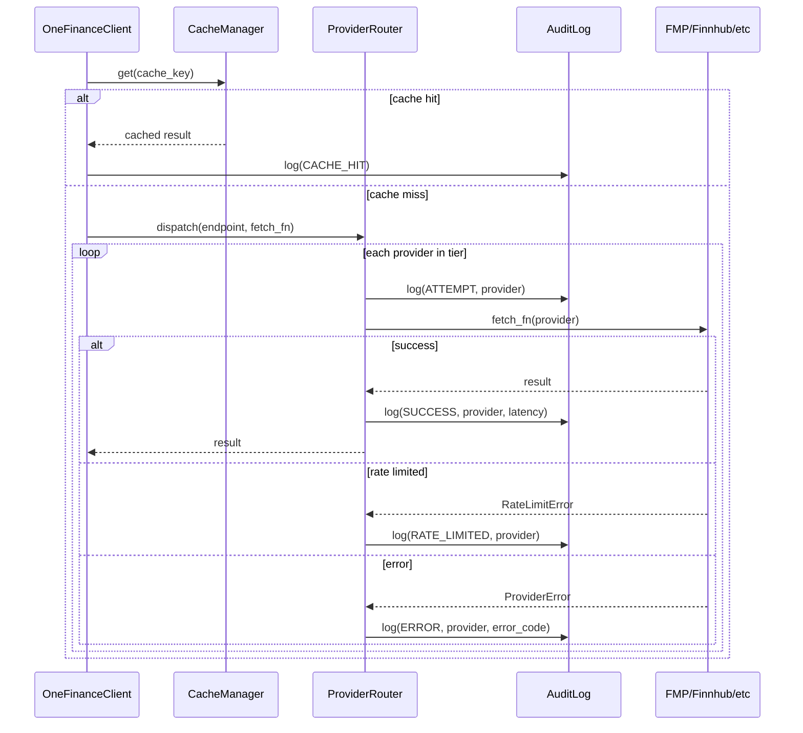

# Audit Log Design: API Invocation Tracing

## Problem

With multiple providers, tier-walking, cooldowns, and caching, it's hard to answer:
- Which provider actually served this data?
- How many FMP calls did I burn today?
- Why did the router skip Finnhub and fall through to yfinance?
- What's my average latency per provider?

We need a structured audit log that traces **every API invocation** through the router.

---

## Design: Intercept at Router Level

The cleanest insertion point is **`ProviderRouter.dispatch()`** — it already sees every attempt, every skip, every failure. We don't need to modify individual providers.



## Data Model

```python
@dataclass(frozen=True)
class AuditEntry:
    """Single audit log entry for a provider API call."""

    timestamp: datetime          # UTC when the call started
    request_id: str              # UUID grouping all attempts for one user call
    endpoint: str                # "price_history", "quote", "dcf", etc.
    provider: str                # "fmp", "finnhub", "yfinance", "cache"
    symbol: str | None           # ticker, if extractable
    status: str                  # "success", "error", "rate_limited", "skipped", "cache_hit"
    latency_ms: float            # wall-clock time for this attempt
    error_code: str | None       # e.g. "NETWORK_ERROR", "PROVIDER_QUOTA_EXHAUSTED"
    error_message: str | None    # human-readable error detail
    tier_position: int           # 0-indexed position in the tier list
    tier_total: int              # total providers in the tier list
    http_status: int | None      # raw HTTP status code if available
    cache_key: str | None        # cache key for cache_hit entries
```

**`request_id`** ties together all attempts within a single `dispatch()` call. E.g., if FMP fails and Finnhub succeeds, both entries share the same `request_id`.

## Storage Backend

> [!IMPORTANT]
> **Decision needed:** How should the audit log be stored?

### Option A: SQLite (recommended)
- Same pattern as `CacheManager` — `diskcache` already brings SQLite
- Queryable: "SELECT COUNT(*) FROM audit WHERE provider='fmp' AND date=today"
- Auto-rotation: keep last N days, configurable
- Default location: `~/.finance_audit/audit.db`

### Option B: Structured JSON log file
- Append-only JSONL file, one line per entry
- Simple, grep-friendly (`cat audit.log | jq '.[] | select(.provider=="fmp")'`)
- Rotation via logrotate or built-in size cap

### Option C: Python `logging` only
- Zero new storage — just structured log messages via the `onefinance.audit` logger
- Consumers attach their own handlers (file, stdout, Datadog, etc.)
- Lightest footprint but not natively queryable

**Recommendation: Option A (SQLite)** — consistent with the cache layer, queryable, self-contained.

## Implementation Plan

### [NEW] `onefinance/audit/__init__.py`
Package init exporting `AuditLog`, `AuditEntry`, `AuditStats`.

### [NEW] `onefinance/audit/log.py`
Core audit log implementation:

```python
class AuditLog:
    """SQLite-backed audit log for provider API calls."""

    def __init__(self, db_path: str | Path | None = None, retention_days: int = 30):
        ...

    def record(self, entry: AuditEntry) -> None:
        """Write an audit entry."""

    def query(
        self,
        *,
        provider: str | None = None,
        endpoint: str | None = None,
        status: str | None = None,
        since: datetime | None = None,
        limit: int = 100,
    ) -> list[AuditEntry]:
        """Query audit entries with filters."""

    def stats(
        self,
        *,
        since: datetime | None = None,
    ) -> AuditStats:
        """Aggregate stats: calls per provider, error rates, avg latency."""

    def _prune(self) -> int:
        """Remove entries older than retention_days."""
```

```python
@dataclass
class AuditStats:
    """Aggregate statistics from audit entries."""
    total_calls: int
    cache_hits: int
    cache_hit_rate: float                          # 0.0 - 1.0
    calls_by_provider: dict[str, int]
    errors_by_provider: dict[str, int]
    avg_latency_ms_by_provider: dict[str, float]
    rate_limits_by_provider: dict[str, int]
    period_start: datetime
    period_end: datetime
```

### [MODIFY] `onefinance/core/router.py`
Inject `AuditLog` and record entries at each decision point in `dispatch()`:

```python
class ProviderRouter:
    def __init__(self, ..., audit_log: AuditLog | None = None):
        self._audit = audit_log

    def dispatch(self, endpoint, fetch_fn, *, fresh=False, ...):
        request_id = uuid4().hex[:12]
        for i, prov in enumerate(providers):
            t0 = time.perf_counter()
            # ... existing logic ...
            # On success/failure, record:
            self._audit.record(AuditEntry(...))
```

### [MODIFY] `onefinance/core/client.py`
- Create `AuditLog` in `__init__` and pass to the router
- Record `cache_hit` entries in `_cached_fetch`
- Expose `client.audit_stats()` and `client.audit_log` for introspection

### [NEW] CLI: `ofclient audit`
```
ofclient audit stats                # aggregate stats for today
ofclient audit stats --days 7       # last 7 days
ofclient audit recent               # last 20 entries
ofclient audit recent --provider fmp --limit 50
```

## Example Output

### `ofclient audit stats`
```
╭─ API Call Stats (last 24h) ─────────────────────────────╮
│ Total calls: 142  │  Cache hits: 89 (62.7%)             │
├──────────┬────────┬─────────┬──────────┬────────────────┤
│ Provider │  Calls │  Errors │ Rate Ltd │  Avg Latency   │
├──────────┼────────┼─────────┼──────────┼────────────────┤
│ fmp      │     38 │       2 │        1 │     245ms      │
│ finnhub  │     12 │       0 │        0 │     189ms      │
│ yfinance │      3 │       1 │        0 │     892ms      │
├──────────┼────────┼─────────┼──────────┼────────────────┤
│ TOTAL    │     53 │       3 │        1 │     312ms      │
╰──────────┴────────┴─────────┴──────────┴────────────────╯
```

### `ofclient audit recent --limit 5`
```
TIME       REQ-ID   ENDPOINT        PROVIDER  STATUS       LATENCY
14:32:01   a3f2b1   price_history   fmp       ✓ success    187ms
14:32:01   a3f2b1   price_history   cache     ✓ cache_hit  0ms
14:31:45   e7c912   quote           fmp       ✗ error      2401ms
14:31:45   e7c912   quote           finnhub   ✓ success    156ms
14:30:02   b1d4e8   dcf             fmp       ✓ success    312ms
```

## Open Questions

> [!IMPORTANT]
> 1. **SQLite vs JSONL vs logging-only?** I recommend SQLite for queryability — consistent with the cache layer pattern. JSONL is lighter if you prefer `jq`-style analysis.
> 2. **Default retention?** Proposing 30 days. Too long wastes disk; too short loses context.
> 3. **Audit on by default?** I'd enable it by default (tiny overhead — one SQLite INSERT per API call) with `audit=False` opt-out on `OneFinanceClient`.
